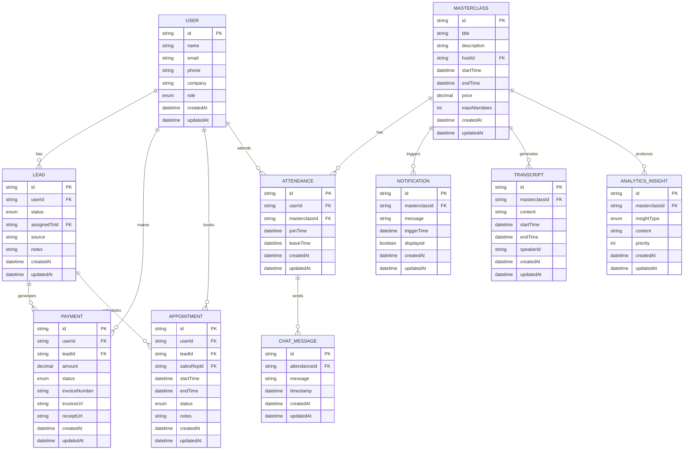

# Influencer Masterclass Hosting Platform - Data Flow Diagrams

This document provides detailed data flow diagrams for the Influencer Masterclass Hosting Platform, illustrating how information moves between different modules of the system.

## System Overview Data Flow

## Detailed Module-Specific Data Flows

### 1. Landing Page to Sales Pipeline Flow

### 2. Payment Processing Flow

### 3. Masterclass Streaming Flow

### 4. Sales Call Scheduling Flow

### 5. Analytics and Feedback Loop Flow

### 6. Complete User Journey Flow

## Data Entity Relationships

These diagrams illustrate the comprehensive data flow within the Influencer Masterclass Hosting Platform, showing how information moves between different modules and how users interact with the system throughout their journey. 